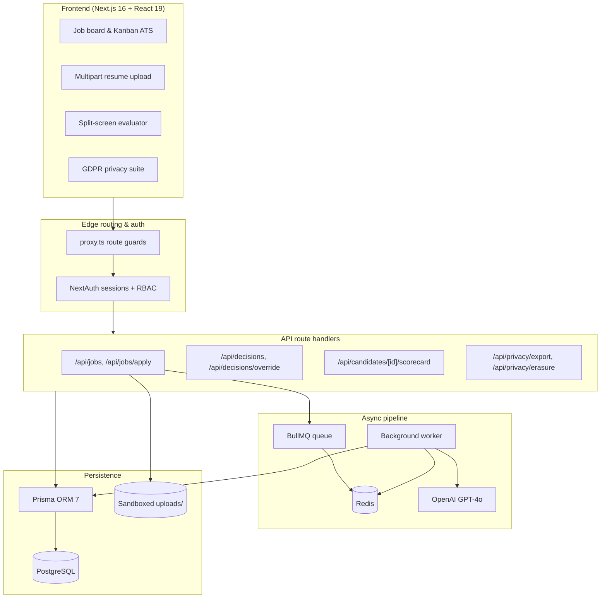

# RecruitAI — AI Resume Screening & Talent Intelligence Platform

[](https://nextjs.org/)
[](https://react.dev/)
[](https://www.typescriptlang.org/)
[](https://www.prisma.io/)
[](https://bullmq.io/)
[](https://openai.com/)
[](#testing)

**RecruitAI** is an evidence-based AI talent acquisition platform and Applicant Tracking System (ATS) built against the **CODAFRIQA Intern Project Specification (Version 1.0)**.

It combines deterministic rubric-based resume screening with verbatim quoted evidence, human-in-the-loop hiring decisions, structured interview scorecards, GDPR data-subject rights, and a tamper-evident audit ledger.

---

## Table of Contents

- [Platform Overview](#platform-overview)
- [Key Features](#key-features)
- [System Architecture](#system-architecture)
- [Role-Based Access Control (RBAC)](#role-based-access-control-rbac)
- [Multilingual Support (i18n)](#multilingual-support-i18n)
- [Technology Stack](#technology-stack)
- [Quick Start](#quick-start)
- [Testing](#testing)
- [Security & Privacy Notes](#security--privacy-notes)
- [Known Gaps & Honest Status](#known-gaps--honest-status)
- [Documentation](#documentation)
- [Author](#author)

---

## Platform Overview

Traditional recruitment pipelines suffer from manual screening fatigue, unconscious evaluator bias, hallucinated keyword matching, and opaque decisions. RecruitAI addresses this with a human-in-the-loop design:

1. **Deterministic match scoring** — AI evaluations are bound to approved job rubrics with fixed weight formulas (`MATCH` = full weight, `PARTIAL` = half, `MISSING`/unassessed = 0). A missing *required* criterion fails the run at 0%.
2. **Verbatim quoted evidence** — every criterion result is grounded with an exact quote from the candidate's CV, surfaced via the OpenAI Structured Outputs JSON schema.
3. **Human authority** — AI never advances candidates. Stage changes (`SHORTLIST`, `ADVANCE`, `HOLD`, `REJECT`, `WITHDRAW`, `REVIEW`) require a logged-in human with a mandatory written rationale.
4. **Privacy by design** — PII is redacted before prompts leave the server; GDPR Article 20 export and Article 17 erasure are built in.

---

## Key Features

| Area | What you get | Where to look |
| :--- | :--- | :--- |
| Cross-tenant job board | Browse open requisitions across organizations with company badges | `src/app/jobs/` |
| Requisition builder | Departments, required vs preferred criteria, weights (1–5), rubric preview | `src/app/api/jobs/`, `src/app/api/jobs/[id]/rubric/` |
| Application intake | PDF/DOCX/TXT upload (≤ 5 MB) with magic-byte validation, layered malware scanning (signature layer + optional ClamAV daemon), rate limiting, explicit consent capture | `src/app/api/jobs/apply/route.ts`, `src/lib/malwareScan.ts`, `src/lib/validation.ts` |
| Async screening | BullMQ + Redis queue with retry/backoff; background worker extracts text and runs GPT-4o structured evaluation | `src/lib/queue.ts`, `src/lib/worker.ts`, `src/lib/scoringEngine.ts` |
| Split-screen evaluation | Original CV beside criterion-by-criterion results with click-to-highlight evidence | `src/app/candidates/[id]/` |
| Blind screening | One-click PII redaction toggle to reduce evaluator bias | `src/lib/resumeProcessor.ts` |
| Non-destructive overrides | Recruiters recalibrate scores with mandatory justification; raw AI result is preserved | `src/app/api/decisions/override/` |
| 6-stage decisions | Auditable `SHORTLIST` / `ADVANCE` / `HOLD` / `REJECT` / `WITHDRAW` / `REVIEW` actions | `src/app/api/decisions/` |
| Interview scorecards | Multi-attribute ratings (technical, communication, problem-solving) and hire recommendations | `src/app/api/candidates/[id]/scorecard/` |
| Kanban pipeline | 5-stage board with search/filter, comparison matrix, duplicate resolver | `src/app/candidates/` |
| GDPR suite | Article 20 JSON export; Article 17 transactional erasure incl. physical file deletion and account anonymization | `src/app/api/privacy/`, `src/app/privacy/` |
| Dashboards & audit | Hiring funnel telemetry, CSV export with formula-injection escaping, tamper-evident hash-chained audit ledger with a nightly verification script | `src/app/dashboard/`, `src/app/audit/`, `src/lib/auditChain.ts`, `scripts/verifyAuditChain.ts` |
| Versioned rubrics | Editing an approved rubric creates a new DRAFT version with a mandatory change reason — the approved version and historical results are never altered | `src/app/api/jobs/[id]/rubric/` |
| Bulk actions | Multi-select pipeline decisions with mandatory reason + explicit confirmation, audited as one transaction | `src/app/candidates/CandidatesClient.tsx`, `src/app/api/candidates/bulk-action/` |
| Operations | `GET /api/health` liveness + admin detail view, `npm run backup` / `npm run restore` with checksums, documented runbook | `src/app/api/health/`, `scripts/backup.sh`, `docs/operations-runbook.md` |
| Manager analytics | §6.10 metrics — time-to-screen, time-in-stage, stage conversion, interviewer completion, workload — with date/job/department/recruiter/stage filters | `src/app/dashboard/analytics/`, `src/app/api/analytics/` |
| AI support copilot | In-app assistant grounded on product knowledge with domain guardrails — including the live skill taxonomy rendered from the same shared table screening uses | `src/lib/supportBrain.ts`, `src/components/SupportWidget.tsx` |

---

## System Architecture



---

## Role-Based Access Control (RBAC)

Authorization is driven by a typed permission matrix — `ROLE_PERMISSIONS` in [`src/lib/roleAccess.ts`](src/lib/roleAccess.ts) — and enforced in route handlers via `requirePermission()` from [`src/lib/auth.ts`](src/lib/auth.ts). Permissions are compiler-checked constants (e.g. `Permission.MakeHiringDecisions`), so a typo is a build error, and granting a role a new capability is a one-line matrix change.

| Role | Scope |
| :--- | :--- |
| **Admin** | Full control: team/role management, all data, audit log, privacy queue |
| **Recruiter** | End-to-end pipeline: jobs, screening, decisions, interviews, offers, merges |
| **Hiring Manager** | Department head: reviews, score recalibration, decisions (no offers) |
| **Interviewer** | Evaluates: scorecards and interview questions; no hiring decisions |
| **Compliance Auditor** | Read-only: audit ledger, scorecard views, GDPR request queue |
| **Candidate** | External seeker: browse jobs, apply, track own applications, self-service GDPR |

---

## Multilingual Support (i18n)

Five languages, switched live without reloads via the `useLanguage()` context: **English (`en`)**, **French (`fr`)**, **Spanish (`es`)**, **German (`de`)**, and **Kinyarwanda (`rw`)** — dictionaries in [`src/lib/i18n/translations.ts`](src/lib/i18n/translations.ts).

> Note: coverage is deepest on navigation, dashboard, and core flows; some secondary screens still fall back to English.

---

## Technology Stack

- **Framework**: [Next.js 16](https://nextjs.org/) (App Router, standalone output) + [React 19](https://react.dev/)
- **Language**: TypeScript 5 (strict)
- **Database/ORM**: PostgreSQL via [Prisma 7](https://www.prisma.io/) with the `@prisma/adapter-pg` driver adapter
- **Queue**: [BullMQ 6](https://bullmq.io/) + ioredis (Upstash-compatible, TLS-aware)
- **AI**: [OpenAI](https://openai.com/) `gpt-4o` with Structured Outputs (JSON-schema-constrained responses)
- **Auth**: NextAuth 4 credentials provider, bcrypt (12 rounds), JWT session callbacks
- **Validation**: Zod 4 on every mutating endpoint
- **Testing**: [Vitest 4](https://vitest.dev/) with Testing Library

---

## Quick Start

### Option A — Docker (recommended)

```bash
git clone https://github.com/stevenbadaga/Ai-Resume-Screening-Platform.git
cd Ai-Resume-Screening-Platform

export OPENAI_API_KEY="sk-proj-your-key-here"   # PowerShell: $env:OPENAI_API_KEY="..."
docker compose up --build
```

This starts the web app (:3000), the screening worker, PostgreSQL 15, and Redis 7. Migrations run automatically on boot.

### Option B — Local Node

Prerequisites: Node 20+, npm 9+, local PostgreSQL and Redis (or Neon/Upstash).

```bash
npm install

# 1. Configure environment — see .env.example for the full list
cp .env.example .env

# 2. Initialize the database
npx prisma generate
npx prisma db push

# 3a. Development
npm run dev

# 3b. Production
npm run build && npm run start
```

Open [http://localhost:3000](http://localhost:3000). Create the first account via `/auth/signin` → signup; the first signup bootstraps the default organization. The BullMQ worker (`src/lib/worker.ts`) must be running for resume screening to process — run it in a separate terminal with `npx tsx src/lib/worker.ts`.

---

## Testing

```bash
npm run test        # Vitest suite (122 tests across 15 files)
npm run typecheck   # tsc --noEmit
npm run lint        # ESLint
```

The suite covers the deterministic scoring engine (including the unassessed-criterion and required-criterion failure rules), the RBAC permission matrix, file magic-byte/malware/path-traversal validation, CSV injection escaping, PII redaction, audit logging behavior, support-copilot guardrails, and the Redis-backed rate limiter (mocked ioredis).

### Integration tests (database-backed)

`__tests__/workflow.integration.test.ts` runs the spec §14 full-workflow integration suite against a **real PostgreSQL database** — strictly scoped to per-run, uniquely-named organizations/emails so it never touches other data, and self-cleaning afterwards:

```bash
TEST_DATABASE_URL="postgresql://..." TEST_INTEGRATION=1 npm test
```

Without `TEST_DATABASE_URL` the integration file self-skips, so plain `npm test` (122 unit tests) never needs a database. With it, 12 additional tests cover: org/role/user isolation, job + rubric DRAFT→APPROVED state machine, consent-compliant application intake, explainable screening-run persistence with evidence (§6.5), human decisions with stage history (§6.7), interview scheduling + conflict detection (§6.8), independent scorecards + interviewer scoping (§5/§6.8), cross-organization tenant isolation (§6.1), transactional §6.11 erasure across linked records, §6.10 analytics aggregation, approved-rubric versioning on edit (§6.2), and audit-ledger tamper detection (§6.1).

CI (`.github/workflows/main.yml`) runs typecheck, tests, and a production build on every push/PR to `main`; failures block the build.

---

## Security & Privacy Notes

- **File safety**: uploads are validated by magic bytes (`%PDF-`, `PK\x03\x04`), size-limited, and scanned by a layered malware scanner — signature layer (EICAR, embedded PE executables, PDF active content, DOCX macros/OLE) always runs, and when `CLAMAV_HOST` is set the bytes are streamed to a ClamAV daemon (fail-closed when unreachable, `docker-compose.yml` ships the service). All file access is sandboxed to the uploads directory (`isPathWithinUploads`).
- **Rate limiting**: Redis-backed fixed-window limiter with automatic in-memory fallback (`src/lib/rateLimit.ts`); applied to login, signup, uploads, and the support chatbot.
- **PII handling**: contact details are redacted before resume text reaches OpenAI; prompts instruct the model never to infer, only quote.
- **CSV safety**: exports escape formula-injection characters (`=`, `+`, `-`, `@`).
- **GDPR**: Article 17 erasure is transactional — physical resume files are unlinked only after path validation, records are anonymized (`ANON-<uuid>`), and sessions are terminated.

These are engineering controls, not certifications — see [Known Gaps](#known-gaps--honest-status).

---

## Known Gaps & Honest Status

An independent review against the spec (2026-09-06) lives in [`docs/independent-requirements-compliance-report.md`](docs/independent-requirements-compliance-report.md). Its summary: a working MVP across all major flows, with these known gaps:

- **Partial spec areas**: compound/multi-role permissions are not consistently enforced end-to-end. Email verification **is** implemented (§6.1) — see the note below. Password reset is implemented too: hashed single-use 30-minute tokens, anti-enumeration endpoints, audit-logged completion — see `src/app/api/auth/forgot-password` and `src/app/api/auth/reset-password`.
- **No fake-success fallbacks**: emails require `RESEND_API_KEY` — when it is missing or delivery fails, the outcome is recorded as `FAILED` on the Communication row (with the error) and surfaced in the API response, never logged as "sent". AI features require `OPENAI_API_KEY` — a missing key is a loud config error, not a silent degradation.
- **Infrastructure-dependent claims**: multi-instance rate limiting needs production infrastructure and end-to-end evidence before being called "done". Rubric versioning **is** implemented (§6.2): editing an approved rubric creates a new DRAFT version with a mandatory change reason, and the approved version keeps scoring until the replacement is approved. Email delivery-state tracking is real (`src/lib/emailService.ts` persists SENT/FAILED + failure info per spec §6.9) but still needs production end-to-end evidence. To gather that evidence: configure `RESEND_API_KEY` (see below), deploy to staging, then trigger each template (application confirmation, interview invite, rejection, offer, team invite, password reset) and verify the `Communication` rows show `SENT` with correct timestamps.
- **Test coverage**: 122 unit tests plus a 12-test database-backed integration suite (`__tests__/workflow.integration.test.ts`, spec §14) covering the full job→rubric→application→screening→decision→interview→scorecard→erasure workflow with tenant-isolation, rubric-versioning, and audit-tamper-detection checks.
- **Manager analytics (spec §6.10)**: `GET /api/analytics` provides time-to-screen, time-in-stage, stage conversion, interviewer completion %, processing-failure and low-confidence counts, and recruiter workload — filterable by date range, job, department, recruiter, and stage, with documented metric definitions. Hiring managers are scoped to their own jobs; department restrictions always apply.
- **Retention configuration & enforcement (spec §6.11/§6.12)**: Admins configure per-status retention periods via `PUT /api/org/retention` (audited with old/new values); `npx tsx scripts/applyRetention.ts` applies the policy on a schedule (dry-run by default, `--apply` to execute).
- **Consent records (spec §6.11)**: applications record the privacy-notice version accepted (`consentNoticeVersion`), acceptance timestamp, and consent choices — not just a boolean. Bump `PRIVACY_NOTICE_VERSION` in `src/lib/validation.ts` when the candidate-facing notice changes materially.
- **Screening reproducibility (spec §6.5/§7)**: every screening run stores the rubric version, resume version, and a full configuration snapshot (model, scoring rules, per-criterion weights/thresholds) alongside the AI version.
- **Interviewer assignment (spec §6.8)**: scheduling accepts `interviewerIds` (same-org active staff); assigned interviewers get notifications and can only view/complete scorecards for interviews they are assigned to; reschedule/cancel notify candidates and all participants.
- **Skill normalization (spec §6.6)**: extracted skills are normalized across common abbreviations and variants (JS→JavaScript, k8s→Kubernetes, postgres→PostgreSQL) while preserving the resume's original wording; exact vs related/transferable vs missing skills are classified separately (`src/lib/skillNormalization.ts`). The canonical taxonomy (`CANONICAL_SKILL_NAMES` / `getSkillTaxonomy()`) is the **single shared skill list**: the screening engine normalizes resume skills through it, and the support copilot renders its skill knowledge from the same table, so the two can never drift apart (pinned by drift-guard tests in `__tests__/skillNormalization.test.ts`).
- **Configuring email delivery (Brevo or Resend)**:
  - **Brevo (recommended when you don't own a domain)** — verify a single *sender email address* (e.g. your Gmail) via a confirmation link — no domain or DNS records needed:
    1. Create an account at [brevo.com](https://brevo.com) (free, 300 emails/day).
    2. Dashboard → **Senders & IP → Senders → Add sender** — enter your email, click the confirmation link Brevo sends you.
    3. Create an API key (**SMTP & API → API Keys → Generate**), starts with `xkeysib-`.
    4. In `.env`: `BREVO_API_KEY="xkeysib-..."` and `EMAIL_FROM="the-sender-you-verified@gmail.com"` (must match the verified sender exactly).
    5. Restart the app. Emails deliver to *any* recipient up to 300/day.
  - **Resend** — create a key at [resend.com/api-keys](https://resend.com/api-keys) (`re_...`), set `RESEND_API_KEY` and either verify a domain or use `EMAIL_FROM="onboarding@resend.dev"` (sandbox — delivers only to your own Resend account email).
  - If both keys are set, Brevo is used. Every send records honest `SENT`/`FAILED` + error detail on its `Communication` row (spec §6.9) — nothing is ever faked.
- **Email verification is required for new signups (spec §6.1)**: an account cannot sign in until its owner clicks the emailed verification link (24 h, single-use, hashed at rest). The sign-in page offers a resend link for unverified accounts; existing accounts created before this change are grandfathered as verified. Known disposable/throwaway inbox providers are rejected at signup. Apply the migration `20260912000000_add_email_verified_at` (`npx prisma migrate dev`) on your next DB connection.
- **RBAC bootstrap — workspace founder becomes Admin**: the first staff signup whose email domain has **no verified workspace** founds a new workspace and becomes its Admin (recorded as the Organization's `primaryOwnerId`), with a DNS TXT challenge pre-seeded for their own email domain. Staff whose email domain **matches a verified workspace** automatically join that workspace as Recruiters — only an Admin can elevate them via the audited team/role endpoint, and the client-supplied role is always ignored server-side. A workspace's identity is its verified email domain (unique across the platform), proven by publishing `recruitai-verify=<token>` at `_recruitai-challenge.<domain>`; display names are cosmetic and never used for routing, so name-squatting gains nothing.
- **Role permission strings are unified**: DB `Role` rows are created (and legacy rows self-heal) from the single RBAC matrix in `src/lib/roleAccess.ts` via `permissionsForRoleName()` — authorization always consults the matrix, and the stored strings can no longer drift from it.
- **The compliance reports in `docs/` are point-in-time reviews**, not guarantees; treat the independent report as the source of truth for current gaps.

---

## Documentation

| Document | Contents |
| :--- | :--- |
| [`docs/PROJECT_DOCUMENTATION.md`](docs/PROJECT_DOCUMENTATION.md) | Architecture, user manual, and operational guide |
| [`docs/independent-requirements-compliance-report.md`](docs/independent-requirements-compliance-report.md) | Independent spec review (2026-09-06) with per-requirement status and qualifications |
| [`docs/specification-compliance-report.md`](docs/specification-compliance-report.md) | Author-prepared spec traceability report |
| [`docs/final-mvp-requirements-report.md`](docs/final-mvp-requirements-report.md) | MVP scope vs delivered features |
| [`docs/requirements-gap-analysis.md`](docs/requirements-gap-analysis.md) | Gap analysis against the spec |
| [`prisma/schema.prisma`](prisma/schema.prisma) | Full database schema (15 models) |

---

## Author

**jospin20** — [jospinshyaka807@gmail.com](mailto:jospinshyaka807@gmail.com) · [GitHub](https://github.com/jospin20)

Built for the CODAFRIQA Intern Project Specification (Version 1.0).
